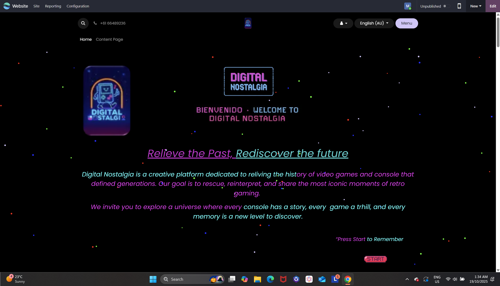
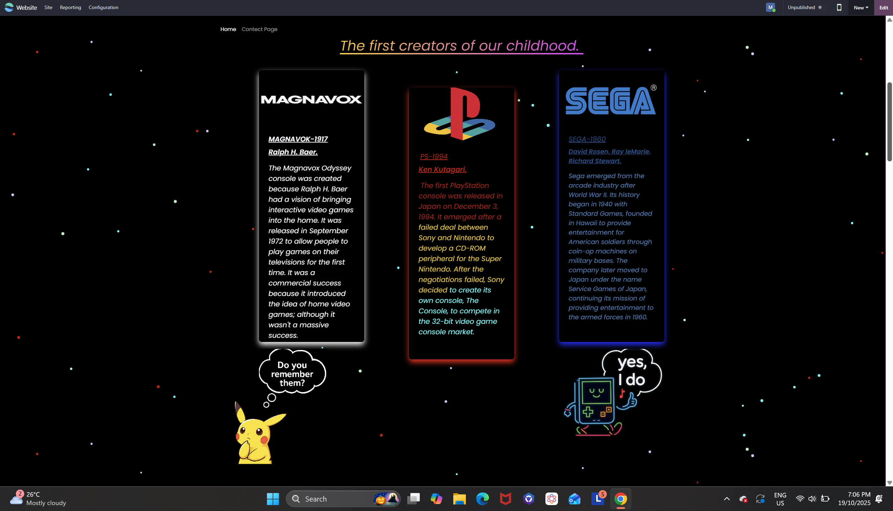
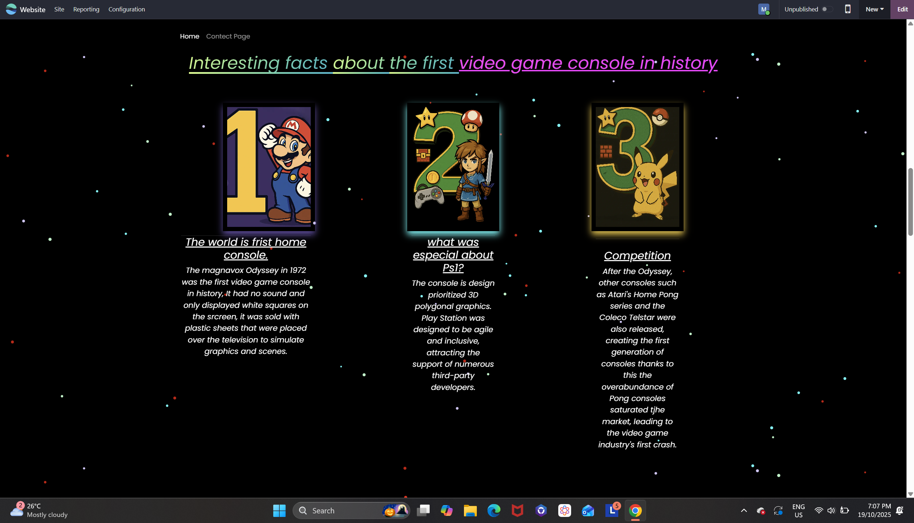
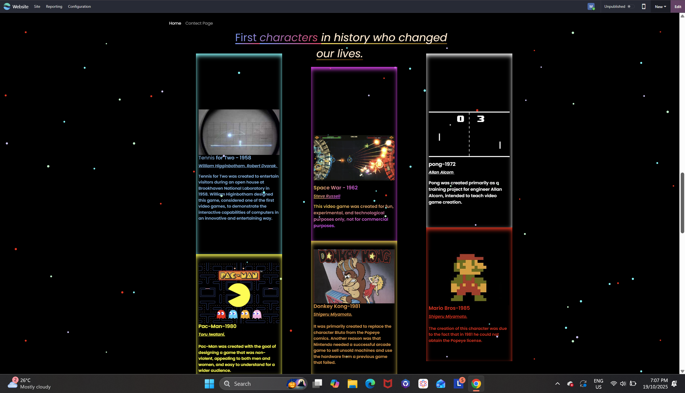

# Digital Nostalgia – Retro Game History Website

## Files Overview
mati.html → Main homepage
mati.css → Main stylesheet
about.html → About page
contact.html → Contact page

magnavox-logo.png → Console logo
playstation-logo.png → Console logo
sega-logo.png → Console logo

1.jpg, 2.jpg → Fact card images
start.jpg, logo.png → UI elements
##  How to Run

1. Download or clone the project.
2. Open *mati.html* in any browser.
3. Use the navigation bar to move between pages.

## Reflection
This project allowed me to explore the full process of designing and building a website using semantic HTML5 and CSS. I began by creating my own low-fidelity prototypes, inspired by the colourful style of retro gaming interfaces. These early sketches were intentionally ambitious: they included neon effects, animated elements, card layouts, large hero sections, and multiple visual highlights. At the start, my goal was to capture the vibrant personality of “Digital Nostalgia,” but I soon realised that my prototypes were far more complex than what could be realistically built within the limits of this assignment.

Because of this, the production process became an exercise in simplification and translation. I needed to take a visually dense prototype and break it down into components that could be created using only HTML and CSS. I focused first on structure: defining sections, text hierarchy, navigation, and content order. I paid attention to semantic markup, ensuring that elements such as header, nav, main, section, and footer were used meaningfully. Once the structure was in place, I gradually added styling and effects that supported the theme without overwhelming the layout.

Throughout development, I worked iteratively. Each time I implemented part of the design, I compared it with the prototype and asked myself whether it improved clarity, supported usability, or enhanced the retro feel. Some ideas from the prototype, such as heavy colour gradients or multiple animated elements, were reduced or removed because they affected readability or made the page feel crowded. Other ideas, like glowing borders, neon typography, and themed cards for historical consoles, translated well into CSS and became defining features of the final site.

I also engaged with good coding practices during the build. I validated my HTML using W3C tools, commented my CSS to explain technical decisions, and checked colour contrast for accessibility. Flexbox allowed me to organise the layout more cleanly, and careful use of selectors helped keep the stylesheet structured and readable.

Overall, this project taught me how to move from concept to implementation in a realistic way. I learnt that strong design is not about copying an ambitious prototype exactly, but about understanding the most important ideas and shaping them into a final product that is functional, readable, and visually engaging.
## Comparison Between Prototype and Final Website
My original prototypes were highly decorative and visually dense, with many bright colours, scattered effects, and complex layouts. They were designed, as shown below, to look exciting and playful, reflecting the energy of retro video games. However, the complexity made them difficult to reproduce using only HTML and CSS.

In contrast, the final website, shown as bottom, keeps the theme of the prototype but simplifies the execution. The neon style, glowing text, and retro atmosphere remain, but they are now presented in a cleaner and more structured way. The card sections for Magnavox, PlayStation, and Sega became more readable and uniform compared to the prototypes. Similarly, the final hero section uses fewer overlapping elements, which improves clarity and accessibility.

The prototype featured many decorative stars and scattered lights, while the final site includes a subtle animated pixel background that captures the same idea but is easier to manage. Colour choices also became more consistent: instead of many competing colours, the final design focuses on a palette of neon blues, pinks, and purples.

Overall, the final site is less visually chaotic, more readable, more accessible, and better aligned with the technical limitations of the assignment, while still keeping the nostalgic aesthetic of the original prototypes.

## Discussion on CSS Techniques: Interactive Image Effect

The interactive visual effects on my webpage are implemented entirely through CSS, using layered positioning, animations, and hover-based transformations. The animated starfield background is created by placing a .starfield container behind all content (z-index: -1) and randomly positioning multiple .star elements inside it. Each star uses a twinkle keyframe animation that changes opacity and scale, creating a dynamic cosmic environment without JavaScript.

For interactive images, I designed card components such as .console-card and .fact-card with glowing borders generated through pseudo-elements (::before and ::after). The glow intensifies on hover, and the entire card lifts slightly using transform: translateY(-10px) scale(1.03). This gives the images a responsive, tactile feel. Shadows, gradients, and transitions work together to make the images appear interactive and alive.
Overall, the effect demonstrates how modern CSS can create visually rich, interactive elements with smooth animations and no scripting.

## Resources that I found helpful while creating the website
W3Schools – HTML, CSS, and JavaScript Tutorials
https://www.w3schools.com
Provided clear explanations and code examples for structuring web pages, styling layouts, and adding interactivity. Helpful for learning responsive design techniques.
MDN Web Docs (Mozilla Developer Network)
https://developer.mozilla.org
Offered in-depth documentation on HTML elements, CSS properties, and accessibility best practices. Used as a reliable reference when coding.
Canva – Graphic Design Tool
https://www.canva.com
Used to design custom graphics and banners for the website, ensuring a consistent and appealing visual style.

